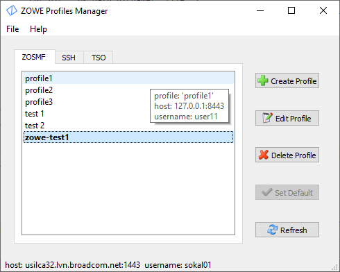

# zowe-profiles-manager
Zowe profile manager GUI. Specially for Broadcom ZOWE Hackaton.

Zowe is an integrated and extensible open source framework for z/OS (a.k.a. MainFrame).

Current version manages only ZOSMF, SSH and TSO ZOWE user profiles.

## Prerequisites
* Zowe CLI is installed in a system and zowe (zowe.cmd) is in the PATH environement.

  <code>https://docs.zowe.org/stable/user-guide/cli-installcli.html</code>

* Install Python3.7 x64

  <code>http://python.org</code>
  
*  Install virtualenv Python module

    <code>C:\Python3_x64\Scripts\pip3.exe install virtualenv</code>
  
* Clone repository

  <code>C:\WORK>git clone git@github.gwd.broadcom.net:as672840/zowe-profiles-manager.git</code>

* Create virtual environment

  <code>cd C:\WORK\zowe-profiles-manager</code>

  <code>C:\Python3_x64\python.exe -m virtualenv venv</code>

* Install required Python modules, run:

  <code>venv\Scripts\pip3.exe install -r requirements.txt</code>

* Set PYTHONPATH
  
  <code>set PYTHONPATH=C:\WORK\zowe-profiles-manager</code>
  
* Run Application

  <code>venv\Scripts\python.exe zpm.py</code>
  

